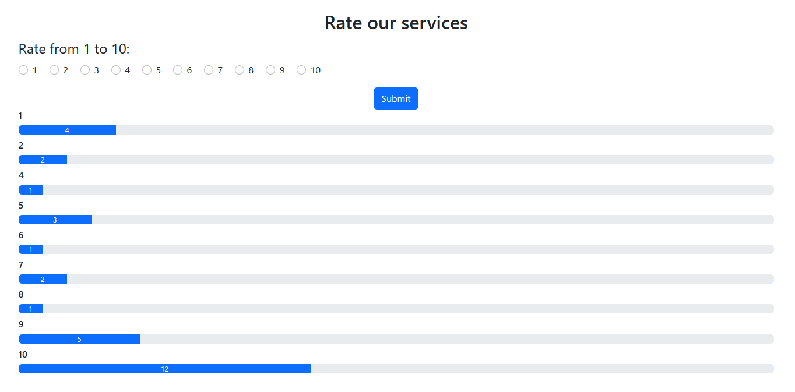

Sladkoejka - Функционал Рейтинга
================================

Этот проект реализует простой функционал рейтинга для веб-сайта под названием Sladkoejka. Пользователи могут оценить услуги, предоставляемые сайтом, по шкале от 1 до 10, оценки пользователей сохраняются на сервере.

Особенности
-----------

-   Пользователи могут выбрать оценку от 1 до 10.
-   Выбранная оценка отправляется на сервер.
-   Сервер обрабатывает оценку и сохраняет ее (в данном примере она фактически не сохраняется нигде, но вы можете изменить это, чтобы сохранять в базе данных).
-   После отправки оценки отображается сообщение об успешной отправке.

Как использовать
----------------

1.  Клонируйте репозиторий.
2.  Откройте проект в вашем предпочитаемом редакторе кода.
3.  Убедитесь, что на вашей системе установлен PHP.
4.  Запустите проект на локальном сервере (например, Apache), чтобы увидеть функционал рейтинга в действии.
- Пример запуска 

 ```bash
php -S localhost:8000
 ```

Файлы
-----

### getRatings.php

```php
<?php
// Считываем содержимое файла с оценками
$ratings = file("ratings.txt", FILE_IGNORE_NEW_LINES | FILE_SKIP_EMPTY_LINES);

// Считаем общее количество голосов
$totalVotes = count($ratings);

// Считаем количество каждой оценки
$counts = array_count_values($ratings);
ksort($counts);

// Выводим количество каждой оценки в виде горизонтальных блоков
foreach ($counts as $rating => $count) { ?>
    <h6><?php echo $rating ?></h6>
    <div class='progress my-2'>
        <?php
        $width = ($count / $totalVotes) * 100;
        ?>
        <div class='progress-bar' role='progressbar' style='width:<?php echo $width ?>%;' aria-valuenow='<?php echo $width ?>'
             aria-valuemin='0' aria-valuemax='100'><?php echo $count ?></div>
    </div>
    <?php
}
```

Этот файл содержит HTML- и PHP-код для функционала рейтинга. В нем определен скрипт для отображения диаграммы оценок.

```php
<?php
if ($_SERVER["REQUEST_METHOD"] == "POST") {
    if (isset($_POST["rating"])) {
        $rating = $_POST["rating"];
        // Логика обработки оценки

        // Сохранение оценки в файл
        $file = fopen("ratings.txt", "a");
        fwrite($file, $rating . "\n");
        fclose($file);
        header('Location: index.php');
        exit;
    } else {
        echo "Error: Rating is not set";
    }
} else {
    echo "Error: Invalid request method";
}
?>
```

Этот код отвечает за обработку данных, отправленных формой. Он принимает оценку от пользователя, если таковая есть в запросе то она записывается на сервере в файл хранящий все оценки.

Используемые технологии
-----------------------

-   PHP для обработки на стороне сервера.
-   Bootstrap для стилизации.

Пример
------



Вывод
------

В результате выполнения данной работы был изучен навык работы с файлами на языке PHP.